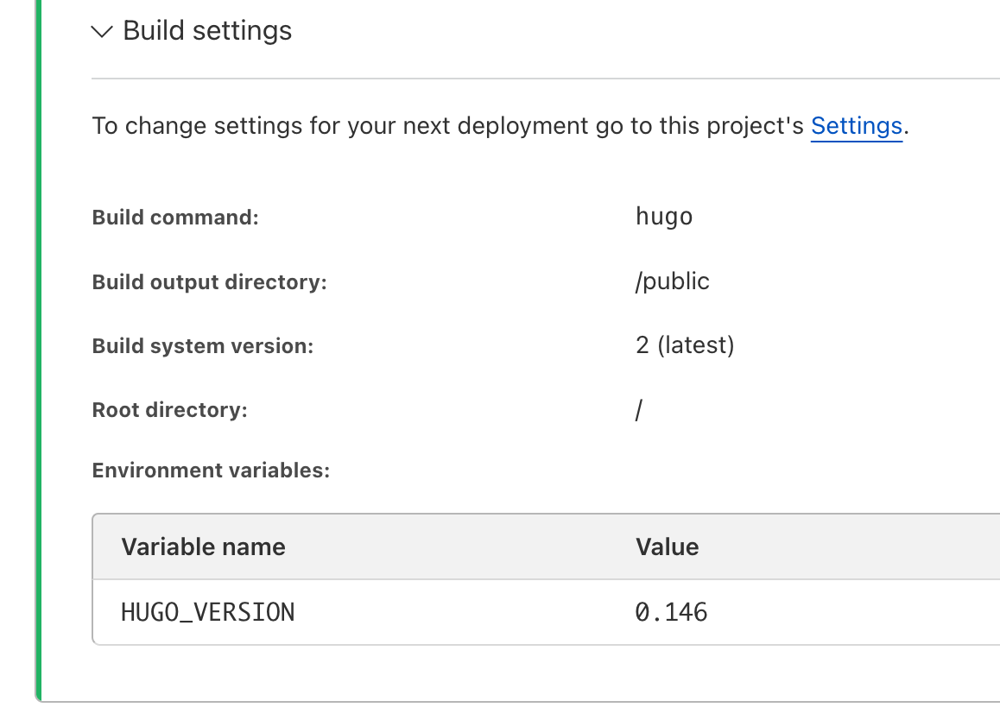

+++
title = 'Cloudflare_deploy'
date = '2025-04-24T17:04:05+09:00'
draft = false
categories = ["Cloudflare"]
+++

## Hugo → GitHub → Cloudflare Pages: Deployment Flow

By combining Hugo, GitHub, and Cloudflare Pages, you can easily set up automated deployment for a static website.

### ✅ No Need to Push `public/` to GitHub

Running `hugo` locally generates a `public/` directory containing static files.
**However, this folder should not be pushed to GitHub** — it's better to exclude it via `.gitignore`.

---

### ✅ How Cloudflare Pages Works

Cloudflare Pages automates deployment using your GitHub repository by following these steps:

#### 📦 1. Clone from GitHub
Cloudflare clones your Hugo project, including files like `content/`, `layouts/`, and `config.toml`.

#### 🔧 2. Run `hugo` on the Server
Cloudflare builds the static site by executing the specified build command (e.g., `hugo`), generating the `public/` folder.

#### 🌐 3. Deploy `public/` to the Web
The static HTML files inside `public/` are then deployed to your live site.



---

### 🔍 Local Project Structure

```plaintext
📁 my-hugo-site/
├── content/
├── layouts/
├── config.toml
├── .gitignore   ← exclude public/
└── public/      ← generated locally, not pushed to GitHub