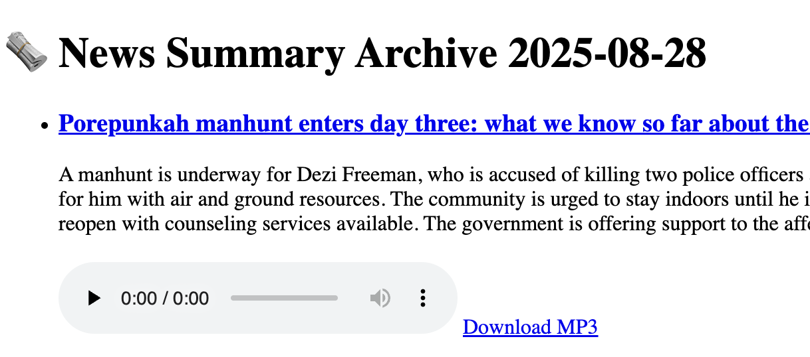

+++
date = '2025-08-28T16:05:30+09:00'
draft = false
title = 'How to Serve MP3 Files with FastAPI + Jinja2 + HTML'
categories = ["fastapi"]
+++


## Background

I built a system in FastAPI to generate archive pages for articles by date.
Along with each article, I wanted to place an audio file (MP3) so that it could be played directly from the web page.
Here’s how I implemented it.

1. Prepare a Directory for MP3 Files

First, configure FastAPI to serve static files.
For example, if you set the output/ directory as the root for static files, any MP3 saved there can be accessed via a URL like /static/xxx.mp3.

```python

# app.main.py
from fastapi import FastAPI
from fastapi.staticfiles import StaticFiles
from pathlib import Path

app = FastAPI()

# Publish the output directory as static files
Path("output").mkdir(parents=True, exist_ok=True)
app.mount("/static", StaticFiles(directory="output"), name="static")

```

With this setup:
output/audio/2025-08-26/article_01.mp3 → /static/audio/2025-08-26/article_01.mp3
becomes accessible.

## 2. Load Article Data from JSON and Attach MP3 Paths

Article information is stored as JSON files by date.
When accessing the API endpoint /archive/{date_str}, it displays the list of news articles for that date.

For each article, we attach the corresponding MP3 file path before passing it to the template.


``` python
# routes/archive.py
from fastapi import APIRouter, Request
from fastapi.templating import Jinja2Templates
from fastapi.responses import HTMLResponse
from pathlib import Path
import json

router = APIRouter()
templates = Jinja2Templates(directory="app/templates")

@router.get("/archive/{date_str}", response_class=HTMLResponse)
async def read_archive(request: Request, date_str: str):
    filepath = Path(f"data/daily_summary_{date_str}.json")

    if not filepath.exists():
        return HTMLResponse(content="Article not found", status_code=404)

    with open(filepath, "r", encoding="utf-8") as f:
        articles = json.load(f)

    # Add audio_path to each article
    for i, article in enumerate(articles, 1):
        article["audio_path"] = f"audio/{date_str}/article_{i:02}.mp3"

    return templates.TemplateResponse("archive.html", {
        "request": request,
        "date": date_str,
        "articles": articles
    })


```


## 3. Display Articles and MP3 Players in the HTML Template

Using a Jinja2 template, we loop through the articles and display the title, summary, and an inline audio player.
A download link is also provided.

```html

<!-- templates/archive.html -->
<!DOCTYPE html>
<html lang="en">
<head>
    <meta charset="UTF-8">
    <title>News Summary Archive</title>
</head>
<body>
    <h1>🗞️ News Summary Archive {{ date }}</h1>
    <ul>
        
            <li style="margin-bottom: 20px;">
                <h3><a href="{{ article.url }}" target="_blank">{{ article.title }}</a></h3>
                <p>{{ article.summary }}</p>

                
                <div>
                    <!-- Inline player -->
                    <audio controls preload="none">
                        <source src="/static/{{ article.audio_path }}" type="audio/mpeg">
                        Your browser does not support the audio element.
                    </audio>

                    <!-- Download link -->
                    <a href="/static/{{ article.audio_path }}" download>Download MP3</a>
                </div>
                
            </li>
        
    </ul>
</body>
</html>


```


This renders an inline audio player along with a download link.

4. Example Output

Each article in the list comes with its own MP3 player, allowing playback directly in the browser or file download.

✅ Click article title → go to the original article

✅ Play inline via the <audio> tag

✅ Save with the Download MP3 link




## Conclusion

The key points for handling MP3 files with FastAPI + Jinja2 are:

1. Configure static file serving (app.mount("/static", ...))

2. Attach audio file paths to article data

3. Use <audio> tags in the template

With this simple setup, you can enrich your article archive with audio playback.