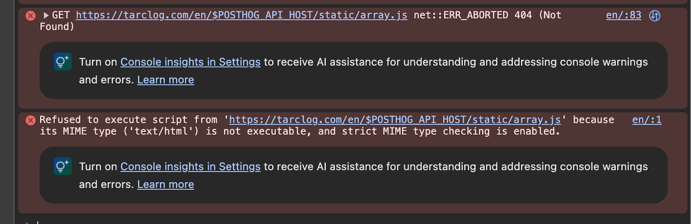
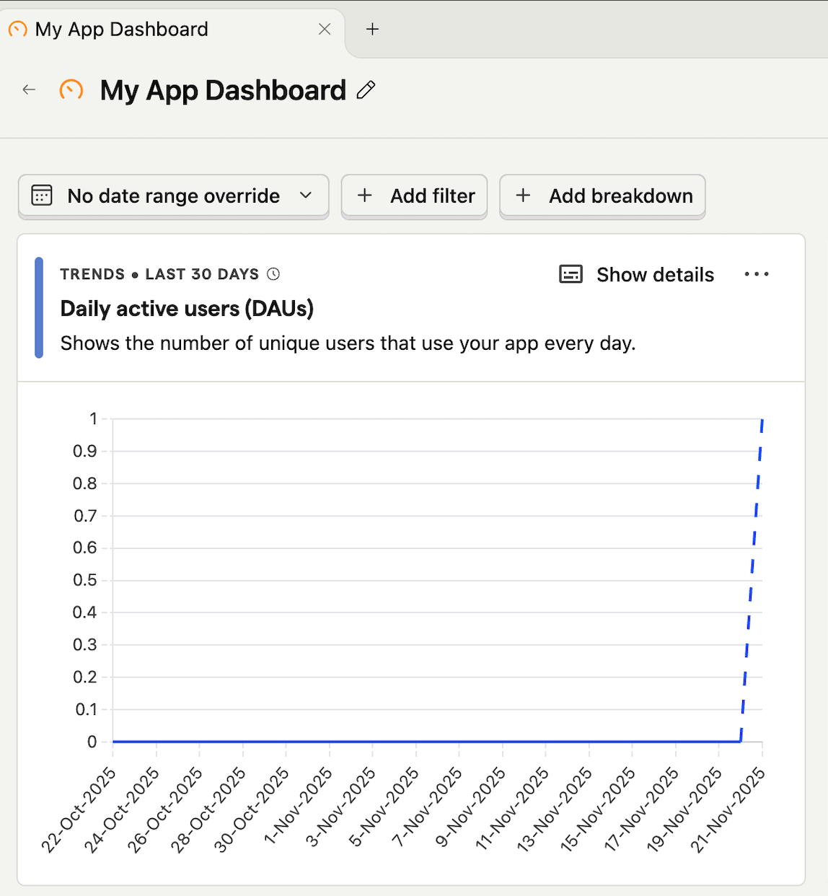

+++
date = '2025-11-21T15:52:06+09:00'
draft = false
title = 'Hugo × Cloudflare Pages × PostHog — Integration Guide'
categories = ["hugo"]
+++


**Hands-on walkthrough: adding DAU tracking to your blog**

This post walks through how to integrate **PostHog (an open-source product analytics platform)** into a blog powered by **Hugo + Cloudflare Pages**, so that you can track **Daily Active Users (DAU)** and page views.

The steps are based on what I actually did when wiring this up for _tarclog.com_.

---

## ✅ Goal (what you’ll have at the end)

- Safely inject the PostHog Web Snippet into Hugo’s `<head>`
- Manage the PostHog API key via **Cloudflare Pages environment variables**
- Extend the PaperMod theme **without breaking it** (override `head.html`)
- See `pageview` events flowing in **real time** in PostHog’s Live Events
- Confirm DAU for your site

---

# 1. Preparing PostHog

## 1.1 Create a new project

1. Go to [https://app.posthog.com](https://app.posthog.com)
2. Click **New Project** → select **Website**
3. From the displayed Web snippet, note the following:

- **YOUR_PROJECT_API_KEY** (public key)
- **api_host**

> The PostHog public key is a “safe to expose” key, not a secret key.

---

# 2. Set environment variables in Cloudflare Pages

Open your target project, then:

Search for **“Workers & Pages”** and select the appropriate site.

Go to:

**Settings tab → Add Variables and Secrets**


Add the following two variables:

| Key                | Value                                 | Type |
|--------------------|----------------------------------------|------|
| `POSTHOG_PUBLIC_KEY` | (Your PostHog public key)             | Text |
| `POSTHOG_API_HOST`   | `https://us.i.posthog.com` (or region host) | Text |

> Since this is a public key, it’s fine to use **Text**, not Secret.

---

# 3. Allow `getenv` in Hugo

For security reasons, Hugo restricts `getenv` by default.
To read environment variables, add the following to **`hugo.toml`**:

```toml
[security]
  [security.funcs]
    getenv = ['^POSTHOG_.+$', '^HUGO_']
```


# 4. Overriding Hugo’s head.html

PaperMod provides the following template:

```bash
themes/PaperMod/layouts/partials/head.html
```

In Hugo, however, layouts under your project take precedence over the theme.

## 4.1 Create an override head.html

Create this file in your project:

```bash
layouts/partials/head.html
```

## 4.2 Full override approach for head.html

PaperMod’s head structure is fairly complex.
If you try to call partial "head.html" from a higher level, Hugo ends up calling itself recursively.

### 4.2.1 The correct approach: copy the theme’s head.html wholesale

Locate the theme’s head.html:

themes/PaperMod/layouts/partials/head.html

Copy it as is to the project side:

layouts/partials/head.html

Hugo will always prefer the project’s layouts directory.
The theme’s original head.html will be ignored once the override exists.

### 4.2.2 Append the PostHog snippet to the copied head.html

At the bottom of the original PaperMod head.html (right before </head>),
append the following snippet.

First, here is the original block (PaperMod’s default head.html):


```html

{{/* === Original PaperMod head === */}}
<meta charset="utf-8">
<meta http-equiv="X-UA-Compatible" content="IE=edge">
<meta name="viewport" content="width=device-width, initial-scale=1, shrink-to-fit=no">
{{- if hugo.IsProduction | or (eq site.Params.env "production") | and (ne .Params.robotsNoIndex true) }}
<meta name="robots" content="index, follow">
{{- else }}
<meta name="robots" content="noindex, nofollow">
{{- end }}

{{- /* Title */}}
<title>{{ if .IsHome }}{{ else }}{{ if .Title }}{{ .Title }} | {{ end }}{{ end }}{{ site.Title }}</title>

{{- /* Meta */}}
{{- if .IsHome }}
{{ with site.Params.keywords -}}<meta name="keywords" content="{{- range $i, $e := . }}{{ if $i }}, {{ end }}{{ $e }}{{ end }}">{{ end }}
{{- else }}
<meta name="keywords" content="{{ if .Params.keywords -}}
    {{- range $i, $e := .Params.keywords }}{{ if $i }}, {{ end }}{{ $e }}{{ end }} {{- else }}
    {{- range $i, $e := .Params.tags }}{{ if $i }}, {{ end }}{{ $e }}{{ end }} {{- end -}}">
{{- end }}
<meta name="description" content="{{- with .Description }}{{ . }}{{- else }}{{- if or .IsPage .IsSection}}
    {{- .Summary | default (printf "%s - %s" .Title  site.Title) }}{{- else }}
    {{- with site.Params.description }}{{ . }}{{- end }}{{- end }}{{- end -}}">
<meta name="author" content="{{ (partial "author.html" . ) }}">
<link rel="canonical" href="{{ if .Params.canonicalURL -}} {{ trim .Params.canonicalURL " " }} {{- else -}} {{ .Permalink }} {{- end }}">
{{- if site.Params.analytics.google.SiteVerificationTag }}
<meta name="google-site-verification" content="{{ site.Params.analytics.google.SiteVerificationTag }}">
{{- end }}
{{- if site.Params.analytics.yandex.SiteVerificationTag }}
<meta name="yandex-verification" content="{{ site.Params.analytics.yandex.SiteVerificationTag }}">
{{- end }}
{{- if site.Params.analytics.bing.SiteVerificationTag }}
<meta name="msvalidate.01" content="{{ site.Params.analytics.bing.SiteVerificationTag }}">
{{- end }}
{{- if site.Params.analytics.naver.SiteVerificationTag }}
<meta name="naver-site-verification" content="{{ site.Params.analytics.naver.SiteVerificationTag }}">
{{- end }}

{{- /* Styles */}}

{{- /* includes */}}
{{- $includes := slice }}
{{- $includes = $includes | append (" " | resources.FromString "assets/css/includes-blank.css")}}

{{- if not (eq site.Params.assets.disableScrollBarStyle true) }}
    {{- $ScrollStyle := (resources.Get "css/includes/scroll-bar.css") }}
    {{- $includes = (append $ScrollStyle $includes) }}
{{- end }}

{{- $includes_all := $includes | resources.Concat "assets/css/includes.css" }}

{{- $theme_vars := (resources.Get "css/core/theme-vars.css") }}
{{- $reset := (resources.Get "css/core/reset.css") }}
{{- $media := (resources.Get "css/core/zmedia.css") }}
{{- $license_css := (resources.Get "css/core/license.css") }}
{{- $common := (resources.Match "css/common/*.css") | resources.Concat "assets/css/common.css" }}

{{- /* markup.highlight.noClasses should be set to `false` */}}
{{- $chroma_styles := (resources.Get "css/includes/chroma-styles.css") }}
{{- $chroma_mod := (resources.Get "css/includes/chroma-mod.css") }}

{{- /* order is important */}}
{{- $core := (slice $theme_vars $reset $common $chroma_styles $chroma_mod $includes_all $media) | resources.Concat "assets/css/core.css" | resources.Minify }}
{{- $extended := (resources.Match "css/extended/*.css") | resources.Concat "assets/css/extended.css" | resources.Minify }}

{{- /* bundle all required css */}}
{{- /* Add extended css after theme style */ -}}
{{- $stylesheet := (slice $license_css $core $extended) | resources.Concat "assets/css/stylesheet.css"  }}

{{- if not site.Params.assets.disableFingerprinting }}
{{- $stylesheet := $stylesheet | fingerprint }}
<link crossorigin="anonymous" href="{{ $stylesheet.RelPermalink }}" integrity="{{ $stylesheet.Data.Integrity }}" rel="preload stylesheet" as="style">
{{- else }}
<link crossorigin="anonymous" href="{{ $stylesheet.RelPermalink }}" rel="preload stylesheet" as="style">
{{- end }}

{{- /* Search */}}
{{- if (eq .Layout `search`) -}}
<link crossorigin="anonymous" rel="preload" as="fetch" href="../index.json">
{{- $fastsearch := resources.Get "js/fastsearch.js" | js.Build (dict "params" (dict "fuseOpts" site.Params.fuseOpts)) | resources.Minify }}
{{- $fusejs := resources.Get "js/fuse.basic.min.js" }}
{{- $license_js := resources.Get "js/license.js" }}
{{- if not site.Params.assets.disableFingerprinting }}
{{- $search := (slice $fusejs $license_js $fastsearch ) | resources.Concat "assets/js/search.js" | fingerprint }}
<script defer crossorigin="anonymous" src="{{ $search.RelPermalink }}" integrity="{{ $search.Data.Integrity }}"></script>
{{- else }}
{{- $search := (slice $fusejs $fastsearch ) | resources.Concat "assets/js/search.js" }}
<script defer crossorigin="anonymous" src="{{ $search.RelPermalink }}"></script>
{{- end }}
{{- end -}}

{{- /* Favicons */}}
<link rel="icon" href="{{ site.Params.assets.favicon | default "favicon.ico" | absURL }}">
<link rel="icon" type="image/png" sizes="16x16" href="{{ site.Params.assets.favicon16x16 | default "favicon-16x16.png" | absURL }}">
<link rel="icon" type="image/png" sizes="32x32" href="{{ site.Params.assets.favicon32x32 | default "favicon-32x32.png" | absURL }}">
<link rel="apple-touch-icon" href="{{ site.Params.assets.apple_touch_icon | default "apple-touch-icon.png" | absURL }}">
<link rel="mask-icon" href="{{ site.Params.assets.safari_pinned_tab | default "safari-pinned-tab.svg" | absURL }}">
<meta name="theme-color" content="{{ site.Params.assets.theme_color | default "#2e2e33" }}">
<meta name="msapplication-TileColor" content="{{ site.Params.assets.msapplication_TileColor | default "#2e2e33" }}">

{{- /* RSS */}}
{{ range .AlternativeOutputFormats -}}
<link rel="{{ .Rel }}" type="{{ .MediaType.Type | html }}" href="{{ .Permalink | safeURL }}">
{{ end -}}
{{- range .AllTranslations -}}
<link rel="alternate" hreflang="{{ .Lang }}" href="{{ .Permalink }}">
{{ end -}}

<noscript>
    <style>
        #theme-toggle,
        .top-link {
            display: none;
        }

    </style>
    {{- if (and (ne site.Params.defaultTheme "light") (ne site.Params.defaultTheme "dark")) }}
    <style>
        @media (prefers-color-scheme: dark) {
            :root {
                --theme: rgb(29, 30, 32);
                --entry: rgb(46, 46, 51);
                --primary: rgb(218, 218, 219);
                --secondary: rgb(155, 156, 157);
                --tertiary: rgb(65, 66, 68);
                --content: rgb(196, 196, 197);
                --code-block-bg: rgb(46, 46, 51);
                --code-bg: rgb(55, 56, 62);
                --border: rgb(51, 51, 51);
            }

            .list {
                background: var(--theme);
            }

            .list:not(.dark)::-webkit-scrollbar-track {
                background: 0 0;
            }

            .list:not(.dark)::-webkit-scrollbar-thumb {
                border-color: var(--theme);
            }
        }

    </style>
    {{- end }}
</noscript>

{{- partial "extend_head.html" . -}}

{{- /* Misc */}}
{{- if hugo.IsProduction | or (eq site.Params.env "production") }}
{{- partial "google_analytics.html" . }}
{{- partial "templates/opengraph.html" . }}
{{- partial "templates/twitter_cards.html" . }}
{{- partial "templates/schema_json.html" . }}
{{- end -}}


```

Now append this PostHog block after it:

```html

{{/* === PostHog Snippet Injection === */}}
{{- $ph_key := getenv "POSTHOG_PUBLIC_KEY" -}}
{{- $ph_host := getenv "POSTHOG_API_HOST" | default "https://us.i.posthog.com" -}}

{{- if $ph_key -}}
<script>
    !function(t,e){var o,n,p,r;e.__SV||(window.posthog && window.posthog.__loaded)||(window.posthog=e,e._i=[],e.init=function(i,s,a){function g(t,e){var o=e.split(".");2==o.length&&(t=t[o[0]],e=o[1]),t[e]=function(){t.push([e].concat(Array.prototype.slice.call(arguments,0)))}}(p=t.createElement("script")).type="text/javascript",p.crossOrigin="anonymous",p.async=!0,p.src=s.api_host.replace(".i.posthog.com","-assets.i.posthog.com")+"/static/array.js",(r=t.getElementsByTagName("script")[0]).parentNode.insertBefore(p,r);var u=e;for(void 0!==a?u=e[a]=[]:a="posthog",u.people=u.people||[],u.toString=function(t){var e="posthog";return"posthog"!==a&&(e+="."+a),t||(e+=" (stub)"),e},u.people.toString=function(){return u.toString(1)+".people (stub)"},o="init Rr Mr fi Cr Ar ci Tr Fr capture Mi calculateEventProperties Lr register register_once register_for_session unregister unregister_for_session Hr getFeatureFlag getFeatureFlagPayload isFeatureEnabled reloadFeatureFlags updateEarlyAccessFeatureEnrollment getEarlyAccessFeatures on onFeatureFlags onSurveysLoaded onSessionId getSurveys getActiveMatchingSurveys renderSurvey displaySurvey canRenderSurvey canRenderSurveyAsync identify setPersonProperties group resetGroups setPersonPropertiesForFlags resetPersonPropertiesForFlags setGroupPropertiesForFlags resetGroupPropertiesForFlags reset get_distinct_id getGroups get_session_id get_session_replay_url alias set_config startSessionRecording stopSessionRecording sessionRecordingStarted captureException loadToolbar get_property getSessionProperty Ur jr createPersonProfile zr kr Br opt_in_capturing opt_out_capturing has_opted_in_capturing has_opted_out_capturing get_explicit_consent_status is_capturing clear_opt_in_out_capturing Dr debug M Nr getPageViewId captureTraceFeedback captureTraceMetric $r".split(" "),n=0;n<o.length;n++)g(u,o[n]);e._i.push([i,s,a])},e.__SV=1)}(document,window.posthog||[]);
    posthog.init("{{ $ph_key }}", {
        api_host: "{{ $ph_host }}",
        person_profiles: 'identified_only',
    })
</script>
{{- end -}}

```

### 4.3 Why this “copy then append” approach is necessary

The “usual” way to override a theme partial in Hugo would be something like:

```html

layouts/partials/head.html
{{ partial "head.html" . }}

```

However, with PaperMod, the structure looks roughly like:

baseof.html → partials/head.html → calls partials/head.html again

So you end up with:

```bash
A → B → A → B → …
```

which causes infinite recursion and build failure.

Hence, the only stable approach with PaperMod is:

Copy the theme’s head.html into your project, then edit that copy directly.

# 5. Deploy and verify

Cloudflare Pages will rebuild and deploy automatically.

## 5.1 Browser-side checks

Open Chrome DevTools:

Network

Check that array.js is being loaded

Verify there are no 404 / 403 errors for the PostHog script

Console

Confirm there are no PostHog-related errors





Make sure to temporarily disable AdBlock / Brave Shields / uBlock Origin,
since PostHog scripts are often blocked by privacy tools.

## 5.2 PostHog dashboard

In Live Events:

pageview events should start showing up

Your own visit should be counted as 1 DAU



→ If you can see that, your setup is working.

# 6. Common issues and fixes

| Symptom             | Cause                         | Fix                                   |
| ------------------- | ----------------------------- | ------------------------------------- |
| Snippet doesn’t run | AdBlock / browser extension   | Disable and reload                    |
| Events don’t arrive | `getenv` blocked              | Check `security.funcs` in `hugo.toml` |
| Public key is empty | Env var missing in Cloudflare | Add as Text and redeploy              |


# 7. Final structure

```bash
/
├── hugo.toml                 # security: getenv allowed
├── layouts/
│   └── partials/
│       └── head.html         # PaperMod head + PostHog snippet
├── themes/
│   └── PaperMod/
│       └── layouts/partials/head.html  # now ignored by override


```

Cloudflare Pages:

```bash
Functions → Environment Variables
POSTHOG_PUBLIC_KEY
POSTHOG_API_HOST


```

With this, your source code and key management are cleanly separated, and the setup is safe to maintain.

# 8. Wrap-up

- PostHog is more open and developer-friendly than GA4

- Hugo × Cloudflare Pages can safely load keys via environment variables

- The safest way to extend PaperMod is to override head.html at the project level

- Once DAU and pageviews are flowing, you can move on to:

  A/B tests

  onboarding / tutorial flow analysis

  funnel analysis and more