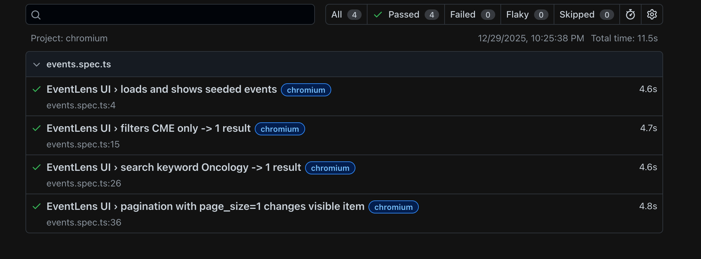
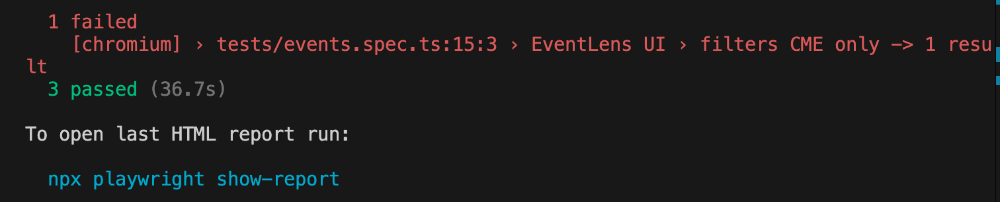
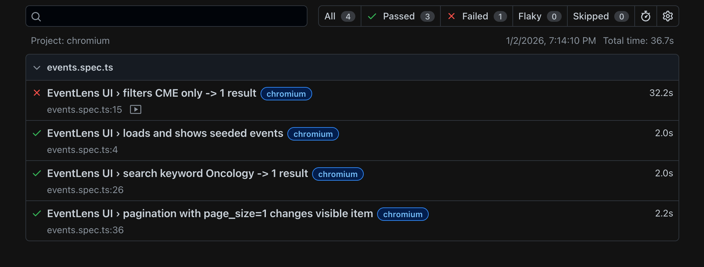
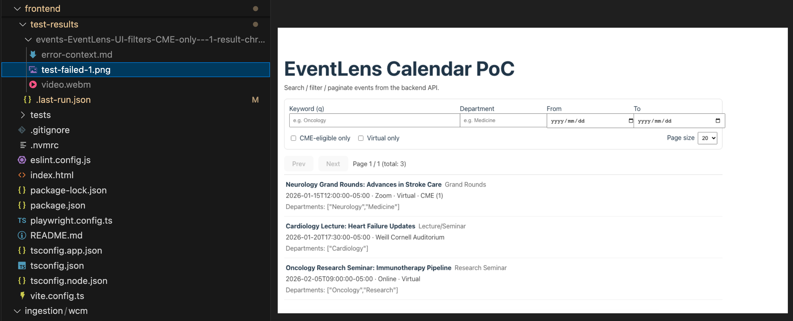

+++
date = '2026-01-04T01:13:58+09:00'
draft = false
title = 'Playwright E2E Testing: Detecting Breaking Changes'
+++


## Introduction

This article is a Playwright E2E testing 101. Starting from setup, we'll explore Playwright's behavior by **intentionally breaking tests to learn failure patterns**.

We'll use "EventLens" (a custom medical event search app) as the target system to examine how common changes like label text modifications affect tests.


---


## Basic Playwright Setup

Let's start with the Playwright installation.

### Installing Dependencies

```bash
npm i -D @playwright/test
npx playwright install --with-deps
```

### Creating Configuration File

Create `playwright.config.ts` and configure integration with the dev server:

```typescript
import { defineConfig, devices } from "@playwright/test";

export default defineConfig({
  testDir: "./tests",
  timeout: 30_000,
  expect: { timeout: 5_000 },
  fullyParallel: true,
  retries: 0,
  reporter: [["list"], ["html", { open: "never" }]],
  use: {
    baseURL: "http://127.0.0.1:5173",
    trace: "on-first-retry",
    video: "retain-on-failure",
    screenshot: "only-on-failure"
  },
  projects: [
    { name: "chromium", use: { ...devices["Desktop Chrome"] } }
  ],
  webServer: {
    command: "npm run dev -- --host 127.0.0.1 --port 5173",
    url: "http://127.0.0.1:5173",
    reuseExistingServer: true,
    timeout: 120_000
  }
});
```

**Key Points:**

- `reuseExistingServer: true` allows reusing an already running dev server
- Automatically saves traces, videos, and screenshots on failure

### Adding Scripts to package.json

```json
{
  "scripts": {
    "test:e2e": "playwright test",
    "test:e2e:ui": "playwright test --ui",
    "test:e2e:report": "playwright show-report"
  }
}
```

## Creating Practical E2E Tests

Create `tests/events.spec.ts` with tests simulating actual user interactions:

```typescript
import { test, expect } from "@playwright/test";

test.describe("EventLens UI", () => {
  test("loads and shows seeded events", async ({ page }) => {
    await page.goto("/");
    await expect(page.getByRole("heading", { name: "EventLens Calendar PoC" })).toBeVisible();

    await expect(page.getByText("Neurology Grand Rounds: Advances in Stroke Care")).toBeVisible();
    await expect(page.getByText("Cardiology Lecture: Heart Failure Updates")).toBeVisible();
    await expect(page.getByText("Oncology Research Seminar: Immunotherapy Pipeline")).toBeVisible();
  });

  test("filters CME only -> 1 result", async ({ page }) => {
    await page.goto("/");

    await page.getByLabel("CME only").check();

    await expect(page.getByText("Neurology Grand Rounds: Advances in Stroke Care")).toBeVisible();
    await expect(page.getByText("Cardiology Lecture: Heart Failure Updates")).not.toBeVisible();
    await expect(page.getByText("Oncology Research Seminar: Immunotherapy Pipeline")).not.toBeVisible();
  });

  test("search keyword Oncology -> 1 result", async ({ page }) => {
    await page.goto("/");

    await page.getByLabel("Keyword (q)").fill("Oncology");

    await expect(page.getByText("Oncology Research Seminar: Immunotherapy Pipeline")).toBeVisible();
    await expect(page.getByText("Neurology Grand Rounds: Advances in Stroke Care")).not.toBeVisible();
    await expect(page.getByText("Cardiology Lecture: Heart Failure Updates")).not.toBeVisible();
  });

  test("pagination with page_size=1 changes visible item", async ({ page }) => {
    await page.goto("/");

    await page.getByLabel("Page size").selectOption("1");

    await expect(page.getByText("Neurology Grand Rounds: Advances in Stroke Care")).toBeVisible();

    await page.getByRole("button", { name: "Next" }).click();
    await expect(page.getByText("Cardiology Lecture: Heart Failure Updates")).toBeVisible();
    await expect(page.getByText("Neurology Grand Rounds: Advances in Stroke Care")).not.toBeVisible();
  });
});
```

At this stage, all tests should pass:

```bash
npm run test:e2e
```


```bash
npx playwright show-report
```



---
<br><br>
## Experiment: Intentionally Breaking Tests

In addition to normal operation, let's examine Playwright's behavior when errors occur.

### Scenario: Changing Label Text

Here, we'll modify a checkbox label:

**Before:** `CME only`
**After:** `CME-eligible only`

Make this change and run the tests:

```bash
npm run test:e2e
```

### Analyzing the Failure

`filters CME only -> 1 result` fails at `page.getByLabel("CME only")` (element not found).



**Review detailed failure report:**

```bash
npx playwright show-report
```

The HTML report displays:
- Test summary (All, Passed, Failed, Flaky, Skipped)
- Results for each test item in Project chromium > events.spec.ts



**Error Report**
Screenshots and videos from error occurrences are saved under the `test-results` directory.



### Failure Pattern Classification (Triage)

This test failure can be classified as:

**Failure Type:** Selector breakage

**Cause:** Test breakage due to specification change

**Characteristic:** Consistently fails, not flaky

The important point is **this is not a real bug**. The application is functioning correctly, but the test code references outdated text, causing the failure.

---

## (Supplement) More Robust Test Design

Design approaches when text changes frequently:

**Design 1: Role-based selectors**

```typescript
// Independent of label text
await page.getByRole("checkbox", { name: /CME/i }).check();
```

**Design 2: Introducing data-testid (for critical flows only)**

```tsx
// Component
<input type="checkbox" data-testid="cme-filter" />

// Test
await page.getByTestId("cme-filter").check();
```

**Design 3: Incorporate test updates into specification change workflow**

- Add "E2E test verification" to Pull Request checklist
- Always run tests before merge when UI text changes

### When to Use data-testid

Adding data-testid to all elements is excessive, so limit to:

- Critical conversion flows for users
- Elements expected to have frequent text changes
- Elements that cannot be uniquely identified by role or label

---
## Comments

This time, we conducted limited verification with simple text changes, but successfully demonstrated Playwright's reporting functionality, screenshot and video saving, and the process of identifying failure causes.