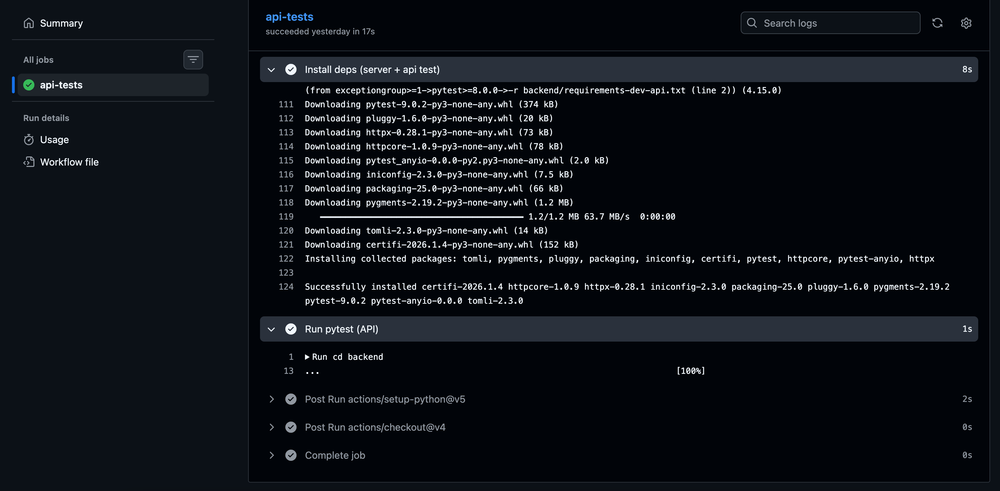

+++
date = '2026-01-09T17:12:44+09:00'
draft = false
title = 'Building a Minimal CI with FastAPI + pytest + GitHub Actions'
categories = ["pytest"]
+++


## Introduction

This article demonstrates how to implement smoke and contract tests for FastAPI APIs using pytest, and set up a minimal CI configuration with GitHub Actions. The goal is to build a reproducible CI environment that doesn't depend on external I/O.

## Goals

By following this article, you'll achieve:

- `pytest` running correctly in your local environment
- Automated `pip install → pytest` execution in GitHub Actions
- Reproducible tests that don't depend on external networks or databases

## Environment

### CI Environment (GitHub Actions)

- Runner: `ubuntu-latest`
- Actions:
  - `actions/checkout@v4`
  - `actions/setup-python@v5`
- Python: `3.10` (fixed in workflow)
- Installed packages (confirmed in CI logs):
  - pytest **9.0.2**
  - httpx **0.28.1**
  - anyio **4.12.1**

The workflow fixes the Python version as follows:

```yaml
- uses: actions/setup-python@v5
  with:
    python-version: "3.10"
```

## Target APIs

For this minimal configuration, we'll test three endpoints:

- `GET /health` - Health check
- `GET /api/items` - Get items list
- `POST /api/items` - Create item (minimal echo implementation for contract verification)

pytest uses httpx's `ASGITransport` to call the app within the same process, so uvicorn startup is unnecessary even in CI.

## Directory Structure

The project directory structure is as follows. **The key point is to fix the working directory for API tests to `backend`.**

```
playwright_flake_triage_poc/
├─ backend/
│  ├─ app/
│  │  └─ main.py
│  ├─ tests/
│  │  ├─ conftest.py
│  │  ├─ app_import.py
│  │  ├─ test_health.py
│  │  └─ test_items.py
│  ├─ pytest.ini
│  ├─ requirements.txt
│  ├─ requirements-dev-api.txt
│  └─ requirements-dev-e2e.txt
└─ .github/
   └─ workflows/
      └─ ci.yml
```

### Operational Points

- **Always run API tests after `cd backend`**
- Place E2E assets like Playwright in `backend/e2e/` and exclude them from pytest's search scope

## Virtual Environment Separation Strategy

To avoid confusion from mixed dependencies, we separate virtual environments into two systems:

- For API: `backend/.venv_api`
- For E2E: `backend/.venv_e2e`

Add the following to `.gitignore`:

```
backend/.venv_*/
```

## Dependency Management

### Server Base Packages (`backend/requirements.txt`)

Basic packages to run the FastAPI application:

```
fastapi
uvicorn[standard]
jinja2
```

In this environment:
```bash
 % python -m pip show fastapi uvicorn anyio | egrep '^(Name|Version):'
Name: fastapi
Version: 0.128.0
Name: uvicorn
Version: 0.40.0
Name: anyio
Version: 4.12.1
```

### API Test Packages (`backend/requirements-dev-api.txt`)

Packages required for API test execution, centered on pytest and httpx:

```
pytest>=8.0.0
httpx>=0.27.0
anyio>=4.0.0
```

## pytest Configuration

In `backend/pytest.ini`, explicitly limit the test search scope to prevent unintended file loading:

```ini
[pytest]
testpaths = tests
norecursedirs = e2e
addopts = -q
markers =
    anyio: run async tests via anyio
```

### Configuration Points

- `testpaths = tests`: pytest only searches the `backend/tests` directory
- `norecursedirs = e2e`: Excludes Playwright directory from search to prevent interference
- `addopts = -q`: Minimizes output in both CI and local environments for readability

## Test Implementation Structure

### FastAPI App Import (`backend/tests/app_import.py`)

The FastAPI application import path can be switched via the `FASTAPI_APP` environment variable.

Example: `FASTAPI_APP=app.main:app`

### pytest Fixture Configuration (`backend/tests/conftest.py`)

- `app` fixture: Loads the FastAPI application
- `client` fixture: Provides a client to call the ASGI app directly with httpx

This configuration allows API behavior verification without starting an actual HTTP server.

## Local Execution Steps

### 1. Create and Activate Virtual Environment

```bash
cd backend
python3 -m venv .venv_api
source .venv_api/bin/activate
```

### 2. Install Dependencies

```bash
python -m pip install --upgrade pip
python -m pip install -r requirements.txt
python -m pip install -r requirements-dev-api.txt
```

### 3. Run pytest

```bash
FASTAPI_APP="app.main:app" python -m pytest -q
```

## GitHub Actions Configuration

Define the following workflow in `.github/workflows/ci.yml`:

```yaml
name: ci

on:
  push:
  pull_request:
  workflow_dispatch:

jobs:
  api-tests:
    runs-on: ubuntu-latest
    timeout-minutes: 10

    steps:
      - uses: actions/checkout@v4

      - uses: actions/setup-python@v5
        with:
          python-version: "3.10"
          cache: "pip"

      - name: Install deps (server + api test)
        run: |
          python -m pip install --upgrade pip
          python -m pip install -r backend/requirements.txt
          python -m pip install -r backend/requirements-dev-api.txt

      - name: Run pytest (API)
        env:
          FASTAPI_APP: "app.main:app"
        run: |
          cd backend
          python -m pytest -q --maxfail=1
```

### GitHub Actions

Confirmed green status in GitHub Actions:



### Workflow Design Intent

- Focus on **test execution only** initially (linters and type checking come later)
- Use `--maxfail=1` option to quickly identify the cause when tests fail
- CI environment remains stable as it doesn't use external I/O

## Common Pitfalls

### 1. Working Directory Issue

If `backend/tests/conftest.py` imports with `from tests...`, running `pytest` from the repository root will result in `ModuleNotFoundError: No module named 'tests'`.

**Solution**: Establish a rule to always run API tests after `cd backend`. Unify this approach in both README and CI.

### 2. anyio Dependency

When running async tests with pytest, anyio is required. Explicitly specifying `anyio>=4.0.0` in `requirements-dev-api.txt` makes the intent clear in CI environments and stabilizes operation.

## Summary

In this article, we created API tests without server startup using pytest + httpx (ASGITransport) for minimal FastAPI endpoints (`/health` and `/api/items`), and built a CI environment with GitHub Actions.

In this PoC, we separated virtual environments for API (pytest) and E2E (Playwright), and fixed pytest's search scope to backend/tests. The purpose is to avoid "dependency and execution target interference" and maintain reproducibility.