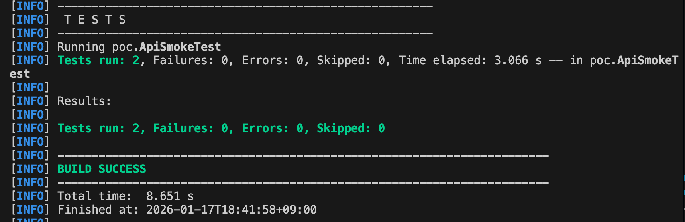

+++
date = '2026-01-18T14:55:39+09:00'
draft = false
title = 'REST Assured PoC'
+++

# Building a Minimal API Test Environment on macOS (REST Assured + Java 21 + mvnw)

## Goal

Create a **minimal PoC** for API testing with REST Assured and understand the basic usage.

The final setup includes:

- Running on Java 21 (Temurin)
- Using Maven Wrapper (mvnw) without deep Maven installation on macOS
- Understanding REST Assured's basic pattern: `given` / `when` / `then`
- Stable tests with local stubs, no external API dependencies

## Prerequisites (Versions / Environment)

- **OS**: macOS 13 (Intel)
- **Java**: Temurin 21 (OpenJDK 21.0.9 LTS)
- **Build**: Maven Wrapper (`./mvnw`)
  - Maven distribution: Apache Maven 3.9.12 (pinned via `maven-wrapper.properties`)
- **Test Framework**: JUnit 5.10.2
- **API Test DSL**: REST Assured 5.5.1
- **Local Stub Server**: OkHttp MockWebServer 4.12.0
- **Test Runner**: Maven Surefire Plugin 3.2.5
- **Compiler Target**: Java 21 (`maven.compiler.source/target = 21`)

### Dependencies (from pom.xml)

- `org.junit.jupiter:junit-jupiter` 5.10.2
- `io.rest-assured:rest-assured` 5.5.1
- `io.rest-assured:json-path` 5.5.1
- `com.squareup.okhttp3:mockwebserver` 4.12.0
- `maven-surefire-plugin` 3.2.5

---

## 1. Install Java 21 (Temurin) via Homebrew

First, set up the Java runtime environment. Install Temurin 21 using Homebrew.

```bash
brew install --cask temurin@21
```

Verify:

```bash
java -version
/usr/libexec/java_home -V
```

If `openjdk version "21.x"` appears, you're good to go.

---

## 2. Create Project: rest_assured_poc

Use the following directory as the project root for this PoC.

```bash
mkdir -p rest_assured_poc
cd rest_assured_poc
```

---

## 3. Use Maven Wrapper (mvnw) Instead of Installing Maven on macOS

Installing Maven directly on macOS can sometimes hang during `make check` for dependency libraries.

For PoC purposes, it's more efficient to use **Maven Wrapper (mvnw)**.

### Introduce Maven Wrapper (only-script)

Place `mvnw` in the project and download Maven to user space.

```bash
curl -L \
  https://repo.maven.apache.org/maven2/org/apache/maven/wrapper/maven-wrapper-distribution/3.3.4/maven-wrapper-distribution-3.3.4-only-script.zip \
  -o maven-wrapper.zip

unzip -q maven-wrapper.zip -x "mvnwDebug*"
rm -f maven-wrapper.zip
```

### Pin Maven Version (e.g., 3.9.12)

```bash
mkdir -p .mvn/wrapper

cat > .mvn/wrapper/maven-wrapper.properties <<'EOF'
distributionUrl=https://repo.maven.apache.org/maven2/org/apache/maven/apache-maven/3.9.12/apache-maven-3.9.12-bin.zip
EOF
```

### Grant Execute Permission:

```bash
chmod +x mvnw
./mvnw -v
```

If the Maven version appears, setup is complete.

---

## 4. pom.xml: REST Assured + JUnit5 + MockWebServer (Minimal)

Java requires dependency management in `pom.xml`, which may look verbose but "this is how it works."

For this PoC, we add **MockWebServer** to avoid hitting external APIs and ensure stable execution.

### pom.xml

```xml
<project xmlns="http://maven.apache.org/POM/4.0.0"
         xmlns:xsi="http://www.w3.org/2001/XMLSchema-instance"
         xsi:schemaLocation="http://maven.apache.org/POM/4.0.0 https://maven.apache.org/xsd/maven-4.0.0.xsd">
  <modelVersion>4.0.0</modelVersion>

  <groupId>poc</groupId>
  <artifactId>rest-assured-poc</artifactId>
  <version>0.1.0</version>

  <properties>
    <maven.compiler.source>21</maven.compiler.source>
    <maven.compiler.target>21</maven.compiler.target>
    <project.build.sourceEncoding>UTF-8</project.build.sourceEncoding>

    <junit.version>5.10.2</junit.version>
    <restassured.version>5.5.1</restassured.version>
    <mockwebserver.version>4.12.0</mockwebserver.version>
  </properties>

  <dependencies>
    <dependency>
      <groupId>io.rest-assured</groupId>
      <artifactId>rest-assured</artifactId>
      <version>${restassured.version}</version>
      <scope>test</scope>
    </dependency>

    <dependency>
      <groupId>io.rest-assured</groupId>
      <artifactId>json-path</artifactId>
      <version>${restassured.version}</version>
      <scope>test</scope>
    </dependency>

    <dependency>
      <groupId>org.junit.jupiter</groupId>
      <artifactId>junit-jupiter</artifactId>
      <version>${junit.version}</version>
      <scope>test</scope>
    </dependency>

    <dependency>
      <groupId>com.squareup.okhttp3</groupId>
      <artifactId>mockwebserver</artifactId>
      <version>${mockwebserver.version}</version>
      <scope>test</scope>
    </dependency>
  </dependencies>

  <build>
    <plugins>
      <plugin>
        <artifactId>maven-surefire-plugin</artifactId>
        <version>3.2.5</version>
        <configuration>
          <useModulePath>false</useModulePath>
        </configuration>
      </plugin>
    </plugins>
  </build>
</project>
```

---

## 5. Minimal Tests: GET/POST (Local Stub)

For this PoC, we initially tried hitting a public API (e.g., reqres.in), but it returned 403 in some environments.

To avoid test failures due to external factors, we switched to **MockWebServer** to create a mock API, making tests fully reproducible.

### Directory

```bash
mkdir -p src/test/java/poc
```

### ApiSmokeTest.java

```java
package poc;

import io.restassured.RestAssured;
import okhttp3.mockwebserver.MockResponse;
import okhttp3.mockwebserver.MockWebServer;
import okhttp3.mockwebserver.RecordedRequest;
import org.junit.jupiter.api.*;

import java.io.IOException;

import static io.restassured.RestAssured.given;
import static org.hamcrest.Matchers.*;

public class ApiSmokeTest {

    private static MockWebServer server;

    @BeforeAll
    static void setup() throws IOException {
        server = new MockWebServer();
        server.start();

        // Set http://127.0.0.1:XXXXX/ as baseURI
        RestAssured.baseURI = server.url("/").toString();
    }

    @AfterAll
    static void teardown() throws IOException {
        server.shutdown();
    }

    @Test
    void get_users_should_return_page_2() {
        // Arrange: Stub response for GET /users?page=2
        server.enqueue(new MockResponse()
                .setResponseCode(200)
                .addHeader("Content-Type", "application/json")
                .setBody("""
                {
                  "page": 2,
                  "data": [
                    {"id": 7, "email": "test@example.com"}
                  ]
                }
                """));

        // Act + Assert (REST Assured)
        given()
            .queryParam("page", 2)
        .when()
            .get("/users")
        .then()
            .statusCode(200)
            .body("page", equalTo(2))
            .body("data", not(empty()))
            .body("data[0].id", equalTo(7));

        // Optional: Verify the actual request sent
        try {
            RecordedRequest req = server.takeRequest();
            Assertions.assertEquals("/users?page=2", req.getPath());
            Assertions.assertEquals("GET", req.getMethod());
        } catch (InterruptedException e) {
            throw new RuntimeException(e);
        }
    }

    @Test
    void create_user_should_return_201_and_id_createdAt() {
        // Arrange: Stub response for POST /users
        server.enqueue(new MockResponse()
                .setResponseCode(201)
                .addHeader("Content-Type", "application/json")
                .setBody("""
                {
                  "name": "michael",
                  "job": "qa",
                  "id": "123",
                  "createdAt": "2026-01-17T18:00:00Z"
                }
                """));

        String payload = """
        {
          "name": "michael",
          "job": "qa"
        }
        """;

        // Act + Assert (REST Assured)
        given()
            .contentType("application/json")
            .body(payload)
        .when()
            .post("/users")
        .then()
            .statusCode(201)
            .body("name", equalTo("michael"))
            .body("job", equalTo("qa"))
            .body("id", notNullValue())
            .body("createdAt", notNullValue());

        // Optional: Verify sent body
        try {
            RecordedRequest req = server.takeRequest();
            Assertions.assertEquals("/users", req.getPath());
            Assertions.assertEquals("POST", req.getMethod());
            Assertions.assertTrue(req.getBody().readUtf8().contains("\"name\": \"michael\""));
        } catch (InterruptedException e) {
            throw new RuntimeException(e);
        }
    }
}
```

---

## 6. Run: ./mvnw test

Execute using Maven Wrapper.

```bash
./mvnw test
```

On success, you'll see:

```
Tests run: 2, Failures: 0

BUILD SUCCESS
```





---

## 7. Key Learnings from This PoC

This minimal PoC confirmed the following about REST Assured:

- API tests can be written using `given`/`when`/`then` pattern
- Status codes and JSON body validation are possible (using Hamcrest)
- External APIs can be unstable due to 403 errors / rate limits
  → **MockWebServer** enables reproducibility with local stubs
- Request verification ("Did we send the correct request?") is possible via `RecordedRequest`

By avoiding external API dependencies, which can fail due to environmental factors, this minimal PoC uses local stubs to create a **deterministic** execution environment.

---

## Summary

As a minimal PoC to understand REST Assured basics, we built:

- Java 21 (Temurin)
- Maven Wrapper (mvnw)
- Two REST Assured smoke tests (GET/POST)
- Local stubs eliminating external dependencies (MockWebServer)

This demonstrates both the basic usage of REST Assured and how to build a stable test environment.