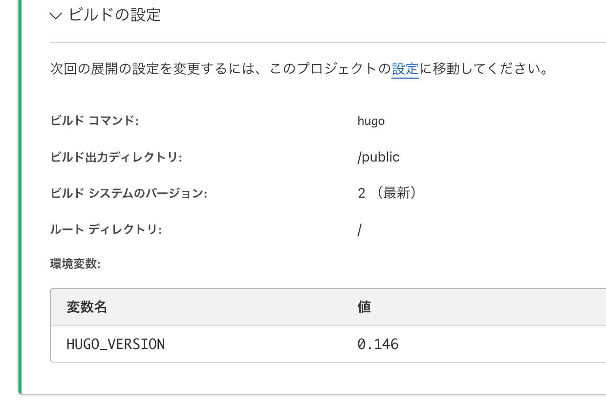

+++
title = 'Cloudflareによるデプロイ'
date = '2025-04-24T17:03:41+09:00'
draft = false
+++


## Hugo → GitHub → Cloudflare Pages の連携について

Hugo を使ったサイトは、GitHub と Cloudflare Pages を組み合わせることで、簡単に自動デプロイできます。

### ✅ GitHub に public/ は不要

ローカルで `hugo` を実行すると `public/` ディレクトリが生成されますが、**この中身（静的ファイル）は GitHub に push する必要はありません**。
むしろ `.gitignore` で除外しておくのが推奨されます。

---

### ✅ Cloudflare Pages 側の仕組み

Cloudflare Pages は、GitHub リポジトリを自動で clone し、以下のような手順で公開用ファイルを生成します：

#### 📦 1. GitHub から clone
Hugo のソースコード（例：`content/`, `layouts/`, `config.toml` など）を取得します。

#### 🔧 2. サーバー上で Hugo を実行
指定されたコマンド（例：`hugo`）により、Cloudflare 上で `public/` フォルダを生成します。

#### 🌐 3. `public/` を Web にデプロイ
生成された静的 HTML ファイルがインターネット上に公開されます。



---

### 🔍 ディレクトリ構成イメージ（ローカル）

```plaintext
📁 my-hugo-site/
├── content/
├── layouts/
├── config.toml
├── .gitignore   ← public/ を除外
└── public/      ← ローカルで生成されるが GitHub には含めない

この仕組みにより、git push だけで最新状態の静的サイトが自動公開されるようになります。
ローカルで public/ を意識しなくて済むので、運用も非常にシンプルです。