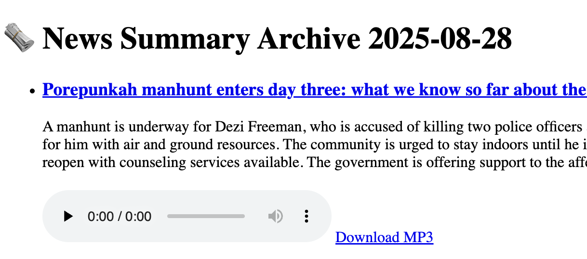

+++
date = '2025-08-28T16:05:17+09:00'
draft = false
title = 'FastAPI + Jinja2 + HTML で mp3ファイルを公開する方法'
categories = ["fastapi"]
+++


## 背景

日付ごとに記事のアーカイブページを生成する仕組みを FastAPI で作りました。その際、各記事に対応する **音声ファイル（MP3）** を配置して、Web ページ上から再生できるようにしました。
今回は、その実装手順を紹介します。


---

## 1. MP3 ファイルを配置するディレクトリを用意する

まず、FastAPI で静的ファイルを配信できるように設定します。
例えば、`output/` ディレクトリを静的ファイルのルートにしておけば、そこに保存した MP3 を `/static/xxx.mp3` の URL でアクセスできます。

```python

# app.main.py
from fastapi import FastAPI
from fastapi.staticfiles import StaticFiles
from pathlib import Path  app = FastAPI()

# output ディレクトリを静的ファイルとして公開
Path("output").mkdir(parents=True, exist_ok=True)
app.mount("/static", StaticFiles(directory="output"), name="static")

```


この設定により、
`output/audio/2025-08-26/article_01.mp3` → `/static/audio/2025-08-26/article_01.mp3`
のようにアクセスできるようになります。

---

## 2. JSON から記事データを読み込み、MP3 パスを付与する

記事情報は日付ごとに JSON で保存しています。
API のエンドポイント `/archive/{date_str}` にアクセスすると、その日のニュース記事一覧を表示します。

記事ごとに対応する MP3 ファイルのパスを付けてテンプレートに渡します。

``` python

# routes/archive.py

from fastapi import APIRouter, Request
from fastapi.templating import Jinja2Templates
from fastapi.responses import HTMLResponse
from pathlib import Path
import json

router = APIRouter()
templates = Jinja2Templates(directory="app/templates")

@router.get("/archive/{date_str}", response_class=HTMLResponse)
async def read_archive(request: Request, date_str: str):
    filepath = Path(f"data/daily_summary_{date_str}.json")

    if not filepath.exists():
        return HTMLResponse(content="Article not found", status_code=404)

    with open(filepath, "r", encoding="utf-8") as f:
        articles = json.load(f)

    # 各記事に audio_path を付与
    for i, article in enumerate(articles, 1):
        article["audio_path"] = f"audio/{date_str}/article_{i:02}.mp3"

    return templates.TemplateResponse("archive.html", {
        "request": request,
        "date": date_str,
        "articles": articles
    })

```


---

## 3. HTML テンプレートで記事と MP3 プレイヤーを表示する

Jinja2 テンプレートで記事をループ処理し、タイトル・サマリーと一緒に音声プレイヤーを配置します。
さらに、ダウンロード用リンクも設置しました。

```html

<!-- templates/archive.html -->
<!DOCTYPE html>
<html lang="en">
<head>
    <meta charset="UTF-8">
    <title>News Summary Archive</title>
</head>
<body>
    <h1>🗞️ News Summary Archive {{ date }}</h1>
    <ul>
        
            <li style="margin-bottom: 20px;">
                <h3><a href="{{ article.url }}" target="_blank">{{ article.title }}</a></h3>
                <p>{{ article.summary }}</p>

                
                <div>
                    <!-- ブラウザ内再生 -->
                    <audio controls preload="none">
                        <source src="/static/{{ article.audio_path }}" type="audio/mpeg">
                        Your browser does not support the audio element.
                    </audio>

                    <!-- ダウンロードリンク -->
                    <a href="/static/{{ article.audio_path }}" download>Download MP3</a>
                </div>
                
            </li>
        
    </ul>
</body>
</html>


```

これで、インライン再生プレイヤーとダウンロードリンクが表示されます。

---

## 4. 実際の表示イメージ

記事一覧のそれぞれに MP3 プレイヤーがつき、ブラウザでそのまま音声を聴いたり、ファイルを保存できるようになります。

- ✅ 記事タイトルをクリック → 元記事へジャンプ

- ✅ `<audio>` タグでその場再生

- ✅ `Download MP3` から保存可能



---

## まとめ

FastAPI + Jinja2 で MP3 を扱うポイントは以下の通りです。

1. **静的ファイルを公開する設定**（`app.mount("/static", ...)`）

2. **記事データに音声パスを付与**

3. **テンプレートで `<audio>` タグを配置**

このシンプルな仕組みで、ニュース記事のアーカイブに音声を付与することができました。