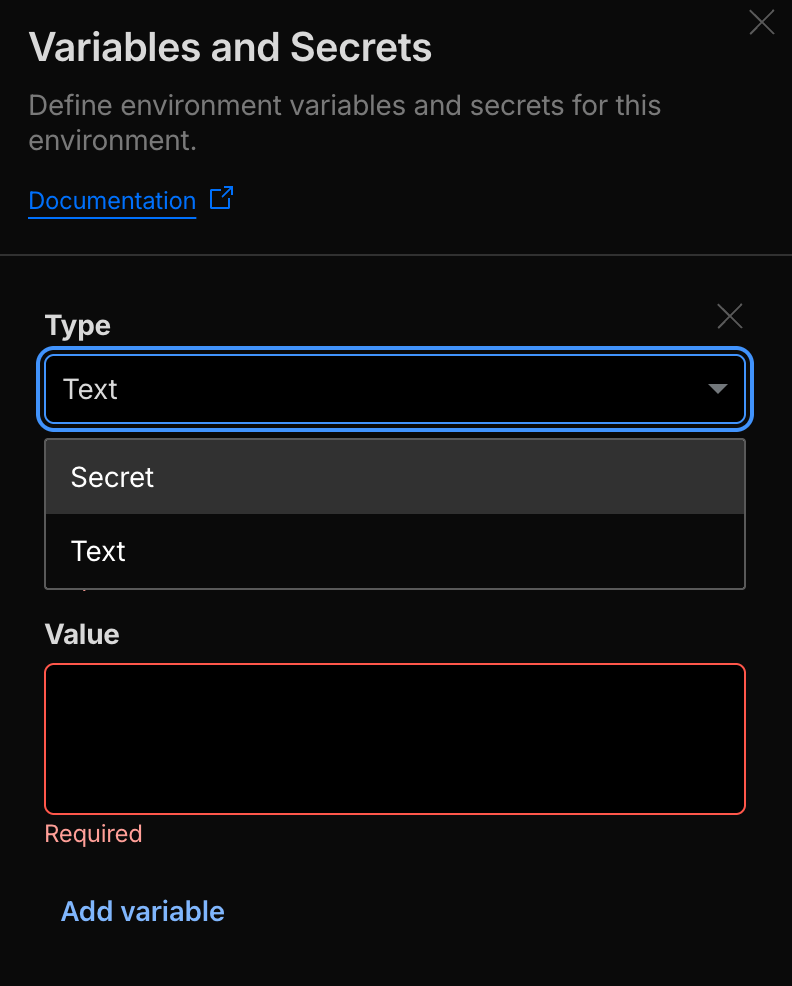

+++
date = '2025-11-21T15:51:52+09:00'
draft = false
title = 'Hugo × Cloudflare Pages × PostHog  — 統合ガイド'
categories = ["hugo"]
+++


**〜ブログに DAU トラッキングを導入するまでの実作業〜**

この記事では、**Hugo + Cloudflare Pages** で運用しているブログに
**PostHog（オープンソースのプロダクト分析ツール）** を組み込み、
**DAU（Daily Active Users）・ページビュー** を取得できるようにするための手順をまとめます。

実際に _tarclog.com_ へ導入した際の作業ログをベースにしています。

---

## ✅ ゴール（できるようになること）

- Hugo の `<head>` に PostHog Web Snippet を安全に注入

- PostHog API Key を **Cloudflare Pages の環境変数で安全管理**

- PaperMod テーマを壊さずに拡張（head.html の override）

- PostHog の **Live Events に pageview がリアルタイムで流れる**

- DAU が確認できる状態になる


---

# 1. PostHog 側の準備

## 1.1 新規プロジェクト作成

1. [https://app.posthog.com](https://app.posthog.com) へアクセス

2. 「New Project」→ **Website** を選択

3. 表示される Web snippet のうち以下を控える：


- **YOUR_PROJECT_API_KEY**（公開キー）

- **api_host**


> ※ PostHog の public key は “公開可能なキー” であり、秘密キーではありません。

---

# 2. Cloudflare Pages に環境変数を設定

対象プロジェクトを開き、以下へ進みます。

「Workers & Pages」で検索して、該当するサイトを選択します。

**Settings タブ → Add Variables and Secrets**





次の 2 つを追加します：

|Key|Value|種類|
|---|---|---|
|`POSTHOG_PUBLIC_KEY`|(PostHog の public key)|Text|
|`POSTHOG_API_HOST`|`https://us.i.posthog.com`（または地域ホスト）|Text|

> ※ Public key のため **Secret ではなく Text でOK**

---

# 3. Hugo で `getenv` が使えるように設定

Hugo はセキュリティ上、デフォルトで `getenv` を制限しています。
環境変数を読み込むため **hugo.toml** に以下を追加します。

```toml
[security]
  [security.funcs]
    getenv = ['^POSTHOG_.+$', '^HUGO_']
```


---

# 4. Hugo の head.html をオーバーライドする

PaperMod テーマには：
```bash
themes/PaperMod/layouts/partials/head.html
```


が存在しますが、Hugo では **プロジェクト側の layouts が最優先で読み込まれます**。

## 4.1 override 用の head.html を作成

以下のパスに新規作成：

```bash
layouts/partials/head.html
```


## 4.2 Hugo の head.html をオーバーライドする（完全版）

PaperMod の head は階層が複雑なため、
`partial "head.html"` を上位から呼ぶと Hugo が自分自身を呼び続けます。

### 4.2.1 正しい手順：**テーマの head.html を丸ごとコピーする**

1. テーマの head.html を探す


`themes/PaperMod/layouts/partials/head.html`

2. これを **そのまま** プロジェクト側へコピーする：


`layouts/partials/head.html`

> ※ Hugo ではプロジェクト側の layouts が最優先で読み込まれる
> （テーマ内部の head.html は無視される）

---

### 4.2.2 コピーした head.html に PostHog Snippet を追記する

オリジナルの PaperMod head.html 下部（`</head>` の直前）に
以下の snippet を追加します。

```html

{{/* === Original PaperMod head === */}}
<meta charset="utf-8">
<meta http-equiv="X-UA-Compatible" content="IE=edge">
<meta name="viewport" content="width=device-width, initial-scale=1, shrink-to-fit=no">
{{- if hugo.IsProduction | or (eq site.Params.env "production") | and (ne .Params.robotsNoIndex true) }}
<meta name="robots" content="index, follow">
{{- else }}
<meta name="robots" content="noindex, nofollow">
{{- end }}

{{- /* Title */}}
<title>{{ if .IsHome }}{{ else }}{{ if .Title }}{{ .Title }} | {{ end }}{{ end }}{{ site.Title }}</title>

{{- /* Meta */}}
{{- if .IsHome }}
{{ with site.Params.keywords -}}<meta name="keywords" content="{{- range $i, $e := . }}{{ if $i }}, {{ end }}{{ $e }}{{ end }}">{{ end }}
{{- else }}
<meta name="keywords" content="{{ if .Params.keywords -}}
    {{- range $i, $e := .Params.keywords }}{{ if $i }}, {{ end }}{{ $e }}{{ end }} {{- else }}
    {{- range $i, $e := .Params.tags }}{{ if $i }}, {{ end }}{{ $e }}{{ end }} {{- end -}}">
{{- end }}
<meta name="description" content="{{- with .Description }}{{ . }}{{- else }}{{- if or .IsPage .IsSection}}
    {{- .Summary | default (printf "%s - %s" .Title  site.Title) }}{{- else }}
    {{- with site.Params.description }}{{ . }}{{- end }}{{- end }}{{- end -}}">
<meta name="author" content="{{ (partial "author.html" . ) }}">
<link rel="canonical" href="{{ if .Params.canonicalURL -}} {{ trim .Params.canonicalURL " " }} {{- else -}} {{ .Permalink }} {{- end }}">
{{- if site.Params.analytics.google.SiteVerificationTag }}
<meta name="google-site-verification" content="{{ site.Params.analytics.google.SiteVerificationTag }}">
{{- end }}
{{- if site.Params.analytics.yandex.SiteVerificationTag }}
<meta name="yandex-verification" content="{{ site.Params.analytics.yandex.SiteVerificationTag }}">
{{- end }}
{{- if site.Params.analytics.bing.SiteVerificationTag }}
<meta name="msvalidate.01" content="{{ site.Params.analytics.bing.SiteVerificationTag }}">
{{- end }}
{{- if site.Params.analytics.naver.SiteVerificationTag }}
<meta name="naver-site-verification" content="{{ site.Params.analytics.naver.SiteVerificationTag }}">
{{- end }}

{{- /* Styles */}}

{{- /* includes */}}
{{- $includes := slice }}
{{- $includes = $includes | append (" " | resources.FromString "assets/css/includes-blank.css")}}

{{- if not (eq site.Params.assets.disableScrollBarStyle true) }}
    {{- $ScrollStyle := (resources.Get "css/includes/scroll-bar.css") }}
    {{- $includes = (append $ScrollStyle $includes) }}
{{- end }}

{{- $includes_all := $includes | resources.Concat "assets/css/includes.css" }}

{{- $theme_vars := (resources.Get "css/core/theme-vars.css") }}
{{- $reset := (resources.Get "css/core/reset.css") }}
{{- $media := (resources.Get "css/core/zmedia.css") }}
{{- $license_css := (resources.Get "css/core/license.css") }}
{{- $common := (resources.Match "css/common/*.css") | resources.Concat "assets/css/common.css" }}

{{- /* markup.highlight.noClasses should be set to `false` */}}
{{- $chroma_styles := (resources.Get "css/includes/chroma-styles.css") }}
{{- $chroma_mod := (resources.Get "css/includes/chroma-mod.css") }}

{{- /* order is important */}}
{{- $core := (slice $theme_vars $reset $common $chroma_styles $chroma_mod $includes_all $media) | resources.Concat "assets/css/core.css" | resources.Minify }}
{{- $extended := (resources.Match "css/extended/*.css") | resources.Concat "assets/css/extended.css" | resources.Minify }}

{{- /* bundle all required css */}}
{{- /* Add extended css after theme style */ -}}
{{- $stylesheet := (slice $license_css $core $extended) | resources.Concat "assets/css/stylesheet.css"  }}

{{- if not site.Params.assets.disableFingerprinting }}
{{- $stylesheet := $stylesheet | fingerprint }}
<link crossorigin="anonymous" href="{{ $stylesheet.RelPermalink }}" integrity="{{ $stylesheet.Data.Integrity }}" rel="preload stylesheet" as="style">
{{- else }}
<link crossorigin="anonymous" href="{{ $stylesheet.RelPermalink }}" rel="preload stylesheet" as="style">
{{- end }}

{{- /* Search */}}
{{- if (eq .Layout `search`) -}}
<link crossorigin="anonymous" rel="preload" as="fetch" href="../index.json">
{{- $fastsearch := resources.Get "js/fastsearch.js" | js.Build (dict "params" (dict "fuseOpts" site.Params.fuseOpts)) | resources.Minify }}
{{- $fusejs := resources.Get "js/fuse.basic.min.js" }}
{{- $license_js := resources.Get "js/license.js" }}
{{- if not site.Params.assets.disableFingerprinting }}
{{- $search := (slice $fusejs $license_js $fastsearch ) | resources.Concat "assets/js/search.js" | fingerprint }}
<script defer crossorigin="anonymous" src="{{ $search.RelPermalink }}" integrity="{{ $search.Data.Integrity }}"></script>
{{- else }}
{{- $search := (slice $fusejs $fastsearch ) | resources.Concat "assets/js/search.js" }}
<script defer crossorigin="anonymous" src="{{ $search.RelPermalink }}"></script>
{{- end }}
{{- end -}}

{{- /* Favicons */}}
<link rel="icon" href="{{ site.Params.assets.favicon | default "favicon.ico" | absURL }}">
<link rel="icon" type="image/png" sizes="16x16" href="{{ site.Params.assets.favicon16x16 | default "favicon-16x16.png" | absURL }}">
<link rel="icon" type="image/png" sizes="32x32" href="{{ site.Params.assets.favicon32x32 | default "favicon-32x32.png" | absURL }}">
<link rel="apple-touch-icon" href="{{ site.Params.assets.apple_touch_icon | default "apple-touch-icon.png" | absURL }}">
<link rel="mask-icon" href="{{ site.Params.assets.safari_pinned_tab | default "safari-pinned-tab.svg" | absURL }}">
<meta name="theme-color" content="{{ site.Params.assets.theme_color | default "#2e2e33" }}">
<meta name="msapplication-TileColor" content="{{ site.Params.assets.msapplication_TileColor | default "#2e2e33" }}">

{{- /* RSS */}}
{{ range .AlternativeOutputFormats -}}
<link rel="{{ .Rel }}" type="{{ .MediaType.Type | html }}" href="{{ .Permalink | safeURL }}">
{{ end -}}
{{- range .AllTranslations -}}
<link rel="alternate" hreflang="{{ .Lang }}" href="{{ .Permalink }}">
{{ end -}}

<noscript>
    <style>
        #theme-toggle,
        .top-link {
            display: none;
        }

    </style>
    {{- if (and (ne site.Params.defaultTheme "light") (ne site.Params.defaultTheme "dark")) }}
    <style>
        @media (prefers-color-scheme: dark) {
            :root {
                --theme: rgb(29, 30, 32);
                --entry: rgb(46, 46, 51);
                --primary: rgb(218, 218, 219);
                --secondary: rgb(155, 156, 157);
                --tertiary: rgb(65, 66, 68);
                --content: rgb(196, 196, 197);
                --code-block-bg: rgb(46, 46, 51);
                --code-bg: rgb(55, 56, 62);
                --border: rgb(51, 51, 51);
            }

            .list {
                background: var(--theme);
            }

            .list:not(.dark)::-webkit-scrollbar-track {
                background: 0 0;
            }

            .list:not(.dark)::-webkit-scrollbar-thumb {
                border-color: var(--theme);
            }
        }

    </style>
    {{- end }}
</noscript>

{{- partial "extend_head.html" . -}}

{{- /* Misc */}}
{{- if hugo.IsProduction | or (eq site.Params.env "production") }}
{{- partial "google_analytics.html" . }}
{{- partial "templates/opengraph.html" . }}
{{- partial "templates/twitter_cards.html" . }}
{{- partial "templates/schema_json.html" . }}
{{- end -}}
```


追加箇所

```html

{{/* === PostHog Snippet Injection === */}}
{{- $ph_key := getenv "POSTHOG_PUBLIC_KEY" -}}
{{- $ph_host := getenv "POSTHOG_API_HOST" | default "https://us.i.posthog.com" -}}

{{- if $ph_key -}}
<script>
    !function(t,e){var o,n,p,r;e.__SV||(window.posthog && window.posthog.__loaded)||(window.posthog=e,e._i=[],e.init=function(i,s,a){function g(t,e){var o=e.split(".");2==o.length&&(t=t[o[0]],e=o[1]),t[e]=function(){t.push([e].concat(Array.prototype.slice.call(arguments,0)))}}(p=t.createElement("script")).type="text/javascript",p.crossOrigin="anonymous",p.async=!0,p.src=s.api_host.replace(".i.posthog.com","-assets.i.posthog.com")+"/static/array.js",(r=t.getElementsByTagName("script")[0]).parentNode.insertBefore(p,r);var u=e;for(void 0!==a?u=e[a]=[]:a="posthog",u.people=u.people||[],u.toString=function(t){var e="posthog";return"posthog"!==a&&(e+="."+a),t||(e+=" (stub)"),e},u.people.toString=function(){return u.toString(1)+".people (stub)"},o="init Rr Mr fi Cr Ar ci Tr Fr capture Mi calculateEventProperties Lr register register_once register_for_session unregister unregister_for_session Hr getFeatureFlag getFeatureFlagPayload isFeatureEnabled reloadFeatureFlags updateEarlyAccessFeatureEnrollment getEarlyAccessFeatures on onFeatureFlags onSurveysLoaded onSessionId getSurveys getActiveMatchingSurveys renderSurvey displaySurvey canRenderSurvey canRenderSurveyAsync identify setPersonProperties group resetGroups setPersonPropertiesForFlags resetPersonPropertiesForFlags setGroupPropertiesForFlags resetGroupPropertiesForFlags reset get_distinct_id getGroups get_session_id get_session_replay_url alias set_config startSessionRecording stopSessionRecording sessionRecordingStarted captureException loadToolbar get_property getSessionProperty Ur jr createPersonProfile zr kr Br opt_in_capturing opt_out_capturing has_opted_in_capturing has_opted_out_capturing get_explicit_consent_status is_capturing clear_opt_in_out_capturing Dr debug M Nr getPageViewId captureTraceFeedback captureTraceMetric $r".split(" "),n=0;n<o.length;n++)g(u,o[n]);e._i.push([i,s,a])},e.__SV=1)}(document,window.posthog||[]);
    posthog.init("{{ $ph_key }}", {
        api_host: "{{ $ph_host }}",
        person_profiles: 'identified_only',
    })
</script>
{{- end -}}
```


---

## 4.3. なぜこのコピー方式が必要なのか

Hugo のテーマ override は通常こうします：

```html
layouts/partials/head.html {{ partial "head.html" . }}
```


しかし PaperMod の場合、
**baseof.html → partials/head.html →さらに partials/head.html を呼ぶ**
という構造になっており、

```bash
A → B → A → B → …
```


という再帰ループが発生してビルドが失敗します。

そのため、
**「テーマ側の head をそのままコピー → 直に追記」**
が PaperMod 流の正しい拡張方法です。


---

# 5. デプロイして動作確認

Cloudflare Pages が自動ビルドして反映されます。

## 5.1 ブラウザ側チェック

Chrome DevTools を開く：

### Network

- `array.js` がロードされているか

- 404 / 403 が出ていないか


### Console

- PostHog 関連のエラーが出ていないか


※ **AdBlock / Brave Shields / uBlock Origin を一時的にオフ** にすること
（PostHog snippet はブロック対象になりやすい）

## 5.2 PostHog Dashboard 側

**Live Events** にて：

- `pageview` が流入

- DAU にあなたのアクセスが 1 件として記録


→ これで成功！

---

# 6. よくあるエラーと解決策

| 症状              | 原因                  | 解決                                |
| --------------- | ------------------- | --------------------------------- |
| Snippet が動かない   | AdBlock / ブラウザ拡張    | 無効化して再読み込み                        |
| Events が届かない    | `getenv` がブロック      | hugo.toml の security 設定を確認        |
| public key が空文字 | Cloudflare の環境変数未設定 | Text で追加（再デプロイ）                   |


---

# 7. 実際の最終構成


```bash
/
├── hugo.toml                 ← getenv 許可設定
├── layouts/
│   └── partials/
│       └── head.html         ← PostHog スニペット追加
├── themes/
│   └── PaperMod/
│       └── layouts/partials/head.html (overrideされるため無視)

```


Cloudflare Pages：

```bash
Functions → Environment Variables
POSTHOG_PUBLIC_KEY
POSTHOG_API_HOST

```

→ これで **ソースコードとキー管理が完全に分離** され、安全性が確保されます。

---

# 8. まとめ

- **PostHog は GA4 より開放的で開発者フレンドリー**

- Hugo × Cloudflare Pages の組み合わせでも **安全に環境変数導入が可能**

- PaperMod を壊さない最適解は「プロジェクト側 head.html の override」

- DAU や pageview が取れるようになれば、
    　次は A/B テスト・チュートリアル分析・ファネル解析も実装可能

