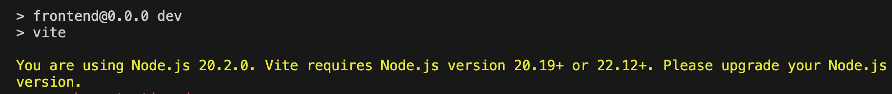

+++
date = '2026-01-02T22:52:46+09:00'
draft = false
title = '新しいターミナルで Node.js のバージョンが戻ってしまう問題の解決法'
categories = ["Node"]
+++


## 事象

開発中に `nvm use` で Node のバージョンを切り替えたのに、新しいターミナルを開いたら元に戻っていました。

この記事では、解決方法を紹介します。


## バージョン情報（検証環境）

macOS(Intel): 13.7.2
Node.js: 20.2.0（問題発生時）→ 22.12.0（解決後）
npm: 10.9.0
nvm: 0.40.3
Vite: 7.2.4
React: 19.2.0


## 問題の症状

Vite などのツールを使っていて、以下のようなエラーが出ることがあります。

```
You are using Node.js 20.2.0. Vite requires Node.js version 20.19+ or 22.12+.
Please upgrade your Node.js version.
```


「あれ？さっき Node 22 に切り替えたはずなのに…」と思って確認すると、確かに古いバージョンに戻っています。

## なぜこの問題が起きるのか

実は、この問題の根本原因は **新しいターミナルを開いたときに nvm が自動的に読み込まれていない** ことです。

### nvm の仕組み

nvm（Node Version Manager）は、複数の Node.js バージョンを切り替えて使えるツールです。しかし、nvm は自動的には動きません。シェル（ターミナル）を起動するたびに、初期化する必要があります。

初期化されていないと、システムにもともと入っている古い Node.js が使われてしまいます。

## 解決方法

この問題を恒久的に解決するには、シェルの設定ファイルに nvm の初期化コードを追加します。

### ステップ1：現状確認

まず、新しいターミナルを開いて、以下のコマンドを実行してみましょう。

```bash
command -v nvm || echo "nvm not loaded"
node -v
```

もし `nvm not loaded` と表示されたら、nvm が読み込まれていません。これが原因です。

### ステップ2：シェル設定ファイルに nvm 初期化を追加

以下のコマンドを実行して、`.zshrc` ファイルに nvm の設定を追加します。

```bash
cat >> ~/.zshrc <<'EOF'

# --- nvm (Homebrew) ---
export NVM_DIR="$HOME/.nvm"
if [ -s "/opt/homebrew/opt/nvm/nvm.sh" ]; then
  . "/opt/homebrew/opt/nvm/nvm.sh"
elif [ -s "/usr/local/opt/nvm/nvm.sh" ]; then
  . "/usr/local/opt/nvm/nvm.sh"
fi

# デフォルトの Node バージョンを自動適用
if command -v nvm >/dev/null 2>&1; then
  nvm use --silent default >/dev/null 2>&1
fi
EOF
```

さらに、`.zprofile` にも同じ設定を入れておきます。

```bash
cat >> ~/.zprofile <<'EOF'

# --- nvm (Homebrew) ---
export NVM_DIR="$HOME/.nvm"
if [ -s "/opt/homebrew/opt/nvm/nvm.sh" ]; then
  . "/opt/homebrew/opt/nvm/nvm.sh"
elif [ -s "/usr/local/opt/nvm/nvm.sh" ]; then
  . "/usr/local/opt/nvm/nvm.sh"
fi
EOF
```

### ステップ3：設定を反映

スニペットが ~/.zshrc に追加されたことを確認します。

```bash
tail -n 20 ~/.zshrc
```


以下のコマンドでシェルを再起動します。

```bash
exec zsh -l
```

### ステップ4：デフォルトバージョンを設定

使いたい Node.js のバージョンをデフォルトとして設定します。

```bash
nvm alias default 22.12.0
```

このコマンドにより、新しいターミナルを開くたびに自動的に Node.js 22.12.0 が使われるようになります。

### ステップ5：確認

**新しいターミナルウィンドウを開いて**、以下を実行してください。

```bash
node -v
```

`v22.12.0` と表示されれば成功です！

## この設定で何が解決されるのか

今回の設定により、以下のことが保証されます。

- 新しいターミナルを開くたびに nvm が自動的に読み込まれる
- デフォルトで指定した Node.js バージョンが自動的に有効になる
- システムの古い Node.js に勝手に戻ることがなくなる

## 注意点

- 上記のコマンドを複数回実行すると、設定が重複して追加されてしまいます。すでに設定済みの場合は、テキストエディタで `.zshrc` や `.zprofile` を開いて、重複部分を削除してください
- Mac の場合、使っている Mac の種類（Apple Silicon か Intel か）によって、nvm のインストール場所が異なります。上記のスクリプトは両方に対応しています

## まとめ

Node.js のバージョンが勝手に戻ってしまう問題は、nvm の自動初期化設定で解決できます。

一度設定すれば、毎回 `nvm use` コマンドを打つ必要もなくなり、快適に開発できるようになります。
