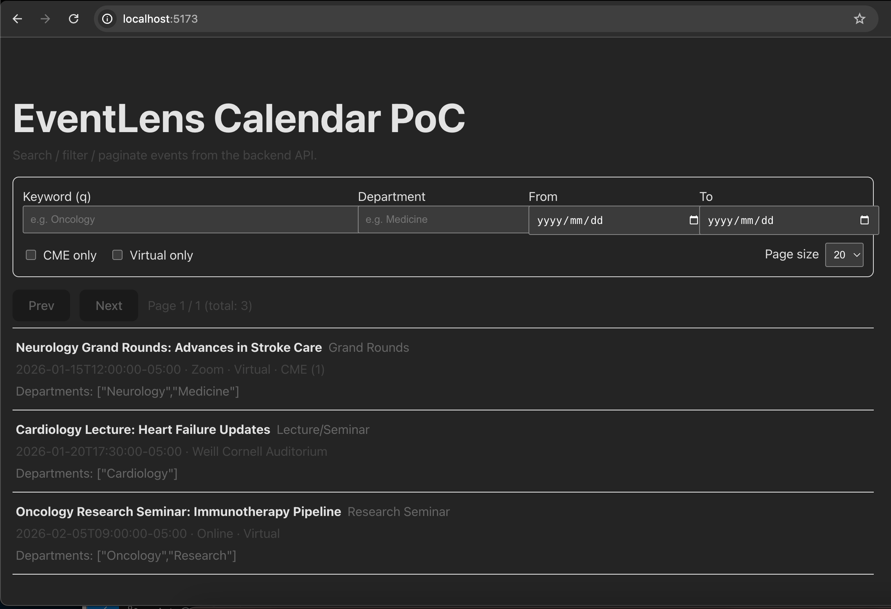

+++
date = '2026-01-04T01:13:50+09:00'
draft = false
title = 'Playwright E2Eテストの変更を検知'
categories = ["Playwright"]
+++

## はじめに

本記事の目的は Playwrightを使ったE2Eテストの 101 です。導入から、**意図的にテストを壊して失敗パターンを学ぶ**アプローチでPlaywrightの動作を確認しています。

今回は医療イベント検索アプリ「EventLens」（自作で用意）を対象システムとして、ラベル文言変更というよくある変更がテストに与える影響を検証します。





---

## Playwright導入の基本設定

まず、Playwrightの導入から始めます。

### 依存関係のインストール

```bash
npm i -D @playwright/test
npx playwright install --with-deps
```

### 設定ファイルの作成

`playwright.config.ts`を作成し、開発サーバーとの連携を設定します：

```typescript
import { defineConfig, devices } from "@playwright/test";

export default defineConfig({
  testDir: "./tests",
  timeout: 30_000,
  expect: { timeout: 5_000 },
  fullyParallel: true,
  retries: 0,
  reporter: [["list"], ["html", { open: "never" }]],
  use: {
    baseURL: "http://127.0.0.1:5173",
    trace: "on-first-retry",
    video: "retain-on-failure",
    screenshot: "only-on-failure"
  },
  projects: [
    { name: "chromium", use: { ...devices["Desktop Chrome"] } }
  ],
  webServer: {
    command: "npm run dev -- --host 127.0.0.1 --port 5173",
    url: "http://127.0.0.1:5173",
    reuseExistingServer: true,
    timeout: 120_000
  }
});
```

**重要なポイント：**

- `reuseExistingServer: true`により、すでに起動している開発サーバーを再利用できます
- 失敗時のトレース、ビデオ、スクリーンショットを自動保存します

### package.jsonへのスクリプト追加

```json
{
  "scripts": {
    "test:e2e": "playwright test",
    "test:e2e:ui": "playwright test --ui",
    "test:e2e:report": "playwright show-report"
  }
}
```

## 実践的なE2Eテストの作成

`tests/events.spec.ts`に、実際のユーザー操作を模したテストを作成します：

```typescript
import { test, expect } from "@playwright/test";

test.describe("EventLens UI", () => {
  test("loads and shows seeded events", async ({ page }) => {
    await page.goto("/");
    await expect(page.getByRole("heading", { name: "EventLens Calendar PoC" })).toBeVisible();

    await expect(page.getByText("Neurology Grand Rounds: Advances in Stroke Care")).toBeVisible();
    await expect(page.getByText("Cardiology Lecture: Heart Failure Updates")).toBeVisible();
    await expect(page.getByText("Oncology Research Seminar: Immunotherapy Pipeline")).toBeVisible();
  });

  test("filters CME only -> 1 result", async ({ page }) => {
    await page.goto("/");

    await page.getByLabel("CME only").check();

    await expect(page.getByText("Neurology Grand Rounds: Advances in Stroke Care")).toBeVisible();
    await expect(page.getByText("Cardiology Lecture: Heart Failure Updates")).not.toBeVisible();
    await expect(page.getByText("Oncology Research Seminar: Immunotherapy Pipeline")).not.toBeVisible();
  });

  test("search keyword Oncology -> 1 result", async ({ page }) => {
    await page.goto("/");

    await page.getByLabel("Keyword (q)").fill("Oncology");

    await expect(page.getByText("Oncology Research Seminar: Immunotherapy Pipeline")).toBeVisible();
    await expect(page.getByText("Neurology Grand Rounds: Advances in Stroke Care")).not.toBeVisible();
    await expect(page.getByText("Cardiology Lecture: Heart Failure Updates")).not.toBeVisible();
  });

  test("pagination with page_size=1 changes visible item", async ({ page }) => {
    await page.goto("/");

    await page.getByLabel("Page size").selectOption("1");

    await expect(page.getByText("Neurology Grand Rounds: Advances in Stroke Care")).toBeVisible();

    await page.getByRole("button", { name: "Next" }).click();
    await expect(page.getByText("Cardiology Lecture: Heart Failure Updates")).toBeVisible();
    await expect(page.getByText("Neurology Grand Rounds: Advances in Stroke Care")).not.toBeVisible();
  });
});
```

この段階では、すべてのテストがパスします：

```bash
npm run test:e2e
```


```bash
npx playwright show-report
```


---
<br><br>
## 実験：意図的にテストを壊す

上記の正常動作に加えて、エラー発生時のPlywrightの挙動を見ていきます。

### シナリオ：ラベル文言の変更

ここでは、チェックボックスのラベルを変更してみます：

**変更前：** `CME only`
**変更後：** `CME-eligible only`

このように変更して、テストを実行します：

```bash
npm run test:e2e
```

### 失敗結果の分析

`filters CME only -> 1 result` が `page.getByLabel("CME only")` で失敗（要素が見つからない）。


**失敗の詳細をレポートで確認：**

```bash
npx playwright show-report
```

HTMLレポートには、下記の内容が一覧表示されています。
- テスト集計 (All, Passed, Fialed, Flaky, Skipped)
- Project chronium > events.spec.ts に含まれる各テスト項目の結果


**エラーレポート**
`test-results` ディレクトリ以下にエラー発生時のスクリーンショットと動画が保存されます。


### 失敗パターンの分類（Triage）

このテスト失敗は以下のように分類できます：

**失敗タイプ：** セレクター破壊

**原因：** 仕様変更によるテスト破壊

**特性：** 毎回確実に失敗する、Flakyではない

重要なのは、**これは本当のバグではない**という点です。アプリケーションは正常に動作しているものの、テストコードが古い文言を参照しているために失敗しています。

---

## （補足）より堅牢なテスト設計

文言が頻繁に変わる場合の設計：

**設計1：roleベースのセレクター**

```typescript
// ラベル文言に依存しない
await page.getByRole("checkbox", { name: /CME/i }).check();
```

**設計2：data-testid の導入（重要な導線のみ）**

```tsx
// コンポネント
<input type="checkbox" data-testid="cme-filter" />

// テスト
await page.getByTestId("cme-filter").check();
```

**設計3：テスト更新を仕様変更のワークフローに組み込む**

- Pull Requestのチェックリストに「E2Eテストの確認」を追加
- UI文言変更時は必ずテストを実行してから merge

### いつdata-testidを使うべきか

すべての要素にdata-testidを付けるのは過剰なので、以下の場合に限定：

- ユーザーにとって重要なコンバージョン導線
- 文言が頻繁に変わることが予想される要素
- roleやlabelでは一意に特定できない要素


---
## コメント

今回は簡易な文言変更で限定的な検証をしてみましたが、
Playwrightのレポート機能、スクリーンショットと動画の保存、失敗原因の特定に至る動作をデモできました。