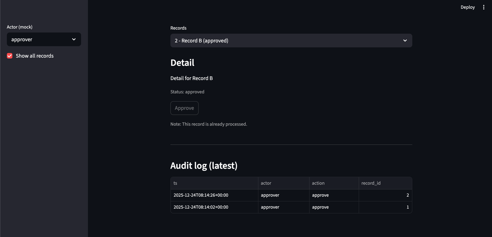

+++
date = '2026-03-10T16:42:03+09:00'
draft = false
title = 'Streamlit + モック API でデモアプリを作る'
categories = ["streamlit"]
+++


Streamlitで「とりあえず動くものを見せる」ことを目的に、
本記事では、承認ワークフローの PoC を **2 ファイル・計約 100 行** で構築しました。





---

## 1. ファイル構成

プロジェクトはシンプルに 2 ファイルで完結しています。

```
project/
├── api_mock.py   # ビジネスロジック・インメモリDB
└── app.py        # Streamlit UI レイヤー
```

UI とロジックを分離することで、将来的に `api_mock.py` を本物の REST API クライアントに差し替えるだけで済む設計になっています。

---

## 2. api_mock.py ─ インメモリ擬似 API

本番環境では DB や外部 API が担う役割を、Python の辞書とリストだけで再現しています。

### データストア

```python
# モジュールレベルの辞書がインメモリ "DB" として機能
_RECORDS: Dict[int, Dict] = {
    1: {"id": 1, "title": "Record A", "status": "pending", "content": "Detail for Record A"},
    2: {"id": 2, "title": "Record B", "status": "pending", "content": "Detail for Record B"},
}
_AUDIT: List[Dict] = []  # 操作ログ
```

> **💡 ポイント：** Streamlit はスクリプトを*毎回上から再実行*しますが、モジュールレベルの変数は Python プロセスが生きている間は保持されます。そのため、この辞書が「セッションを超えた状態」として機能します。

### 主要 API 関数の一覧

| 関数名 | 引数 | 戻り値 | 役割 |
|---|---|---|---|
| `fetch_records()` | `status="pending"` | `List[Dict]` | レコード一覧取得（フィルタ付き） |
| `fetch_detail()` | `record_id` | `Dict` | 個別レコードの詳細取得 |
| `approve_record()` | `record_id, actor` | `bool` | 承認処理（二重承認ガード付き） |
| `fetch_audit()` | `limit=20` | `List[Dict]` | 操作ログ取得（新しい順） |

### 承認ロジックの二重ガード

```python
def approve_record(record_id: int, actor: str = "approver") -> bool:
    """Approve only if pending. Return True on success."""
    r = _RECORDS.get(record_id)
    if not r:
        return False
    if r["status"] != "pending":   # ← 二重承認ガード
        return False

    r["status"] = "approved"
    _AUDIT.append({
        "ts":        datetime.now(timezone.utc).isoformat(timespec="seconds"),
        "actor":     actor,
        "action":    "approve",
        "record_id": record_id,
    })
    return True
```

`status != "pending"` のチェックが **冪等性（べきとうせい）** を保証します。同じレコードを二度 Approve しようとしても、二度目は `False` を返してログに記録されません。この 1 行が、本番環境でも使えるロジックの核心です。

---

## 3. app.py ─ Streamlit UI レイヤー

UI 全体の流れは次のように構成されています。

```
サイドバー設定 → レコード一覧取得 → 詳細表示 → 承認ボタン → 監査ログ
```

### サイドバー：モック認証

```python
# PoC なので本物の認証は不要 ── selectbox で役割を切り替え
actor    = st.sidebar.selectbox("Actor (mock)", ["approver", "requester", "admin"], index=0)
show_all = st.sidebar.checkbox("Show all records", value=False)
```

役割ごとの想定ユースケースは以下の通りです。

- **approver** ─ 承認ボタンが有効になる唯一の役割。本番では RBAC と連携。
- **requester** ─ 閲覧専用。自分が起票したレコードを確認するユースケース。
- **admin** ─ 全レコード表示など管理系操作の拡張余地を残す。

### 承認ボタン：3 段階の制御

```python
can_approve = (actor == "approver")           # 役割チェック
is_pending  = (detail["status"] == "pending") # ステータスチェック
disabled    = (not can_approve) or (not is_pending)  # どちらかでも NG なら無効化

if st.button("Approve", disabled=disabled):
    ok = approve_record(detail["id"], actor=actor)
    if ok:
        st.success("Approved")
    else:
        st.warning("Not pending (already processed).")
    st.rerun()  # UI を即時更新
```

> **✅ 多層防御：** `disabled` フラグで UI レベルのガードを設けつつ、`approve_record()` 内でも二重チェックしています。UI のガードをすり抜けてもロジック側で防御できる「多層防御」の考え方です。

### st.rerun() で状態を即時反映

Streamlit は通常、ユーザー操作があるたびにスクリプト全体を再実行します。`st.rerun()` を明示的に呼ぶことで、ボタン押下直後に画面が最新状態に更新されます。これにより「承認したのに画面がまだ pending」という混乱を防ぎます。

### 監査ログの表示

```python
audit = fetch_audit(limit=20)
if audit:
    st.dataframe(audit, width="stretch")  # 辞書リストをそのままテーブル表示
else:
    st.caption("No audit events yet.")
```

`st.dataframe()` はリスト形式の辞書をそのまま受け取って綺麗なテーブルとして表示します。ソート・スクロール・全画面表示まで自動で対応。ゼロ実装コストで監査画面が完成します。

---

## 4. PoC としての設計ポイント

| ポイント | 説明 |
|---|---|
| 差し替えやすい構造 | UI は API 関数を呼ぶだけ。`api_mock.py` を HTTP クライアントに変えれば本番移行完了。 |
| 多層防御 | UI の `disabled` + ロジックの `status` チェックで二重ガード。 |
| 監査証跡 | 誰が・いつ・何を承認したかを UTC タイムスタンプ付きで記録。 |
| 即時フィードバック | `st.rerun()` で操作結果を即座に画面に反映。UX のストレスゼロ。 |

---

## 5. 次のステップ：拡張アイデア

### 短期（PoC 強化）

レコードの追加・削除フォームを実装して、データの CRUD を完成させましょう。`st.form()` と `st.text_input()` で数行です。

### 中期（本番移行）

`api_mock.py` 内の関数シグネチャを保ちながら、内部実装を `requests` や `httpx` を使った REST API 呼び出しに置き換えます。UI 側は一切変更不要です。

### 長期（エンタープライズ化）

Streamlit の認証機能や SSO を使い、モック actor を本物の認証システムに置き換えることで、エンタープライズ対応の承認ワークフローシステムに進化します。

> **💡 補足：** Streamlit は本番運用にも使えますが、複雑なリアルタイム更新が必要な場合は FastAPI + React への移行も検討してください。PoC で要件を固めてから技術選定するのが最善です。

---

## まとめ

- **2 ファイル分離**でロジックと UI を疎結合に保つ
- `_RECORDS` 辞書が Streamlit プロセス内のインメモリ DB として機能する
- **多層防御**（UI disabled + ロジック側 status チェック）で冪等性を保証
- `st.rerun()` で承認後の即時 UI 更新を実現
- `st.dataframe()` で辞書リストを 1 行でテーブル表示
- 将来の本番移行を見越した「差し替えやすい」API インターフェース設計